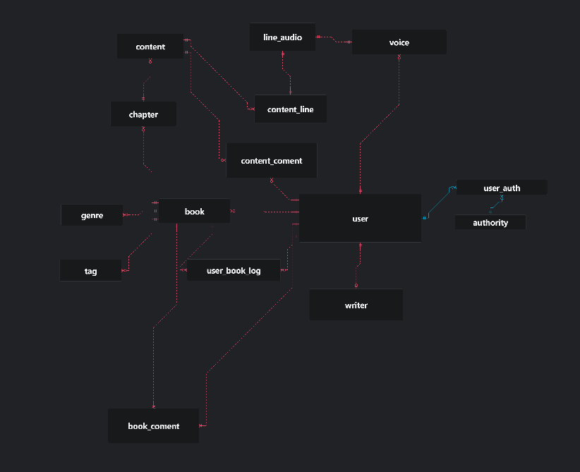

# VOXLIBER : 웹 오디오북 사이트

## 프로젝트 소개
현재 오디오북들은 좋은 퀄리티의 오디오북을 만들어 독자에게 다양한 경험을 제공해주지만 일반인이 자신만의 오디오북을 제작하기엔 성우, 편집, 사운드등의 여러 조건과 제작비가 생깁니다. 자신의 소설과 IP 가 있지만 이걸 오디오북을 만들어 독자들에게 생생한 경험을 제공하는데 이때까지 많은 제약이 있었습니다. 하지만 VOXLIBER 에서는 이 문제점을 해결했습니다. 조작법과 시스템에 대한 이해도가 있으면 자신만의 오디오북을 만들 수 있습니다. 배경음, 사운드 이펙트를 넣어서 더욱 생생한 상황을 경험할 수 있게 해줍니다. 다양한 소설을 오디오북을 만들어 보세요. 다른 사람과의 공유를 통해 더 나은 오디오북을 만들어 보세요.

## 왜 VOXLIBER 인가?
voxliber는 라틴어에서 유래했습니다. liber는 라틴어로 책, 자유를 의미하고 vox는 현대 영어의 voice (목소리)에서 유래했습니다. 책의 목소리라는 뜻의 voxliber라는 이름으로 짓게 되었습니다.

## 개발기간
- 2025.11.19 ~ 2026.01.02

## 오디오북 일부
[첫 만남, 조용한 페이지 사이에서](https://voxliber.ink/book/content/21/)

## 사이트 링크
- https://voxliber.ink

## 기술 스택
#### Backend
- Django
- Django REST Framework
- Python
- FAST API
#### Frontend
- HTML5
- CSS3
- JavaScript, AJAX
#### Database 
- MySQL

### Hosting
- Gunicorn
- nginx, systemd
- AWS EC2
#### API
- OPEN AI API
- ELEVENLABS API 
- GOOGLE CLENT API
#### IDE / 기타
- vs code
- GitHub

## VOXLIBER 사용 방법
- 목소리 선택하기
(https://youtu.be/Z9rUtJR-wJ0)

- 감정리스트
(https://youtu.be/Z9rUtJR-wJ0)

- 대사
(https://youtu.be/E142utmAkr0)

- 기타
(https://youtu.be/9y9EmmGfDQs)

- 미리듣기
(https://youtu.be/9hRlR6TZS04)

- 배경음
(https://youtu.be/F1qoC5R23-Y)

- 사운드이펙트
(https://youtu.be/YNk8h8DjIjM)

- 음성 설정
(https://youtu.be/igt1UaCfCcw)

- 임시저장 
(https://youtu.be/d_Wsa7zAIC0)

- 페이지 오디오
(https://youtu.be/OdV6X4KTplQ)

## 초기 DB 설계도
 

- 초기 ERD 컨셉과 현재 DB 와는 차이가 있을 수 있습니다.